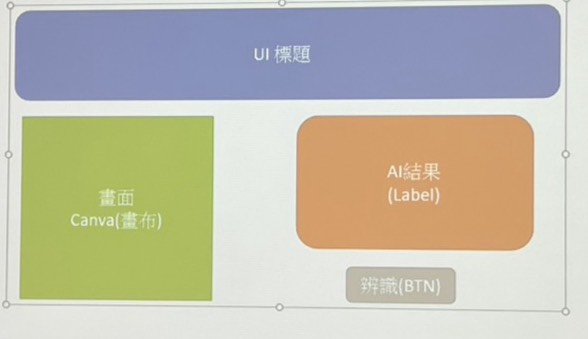
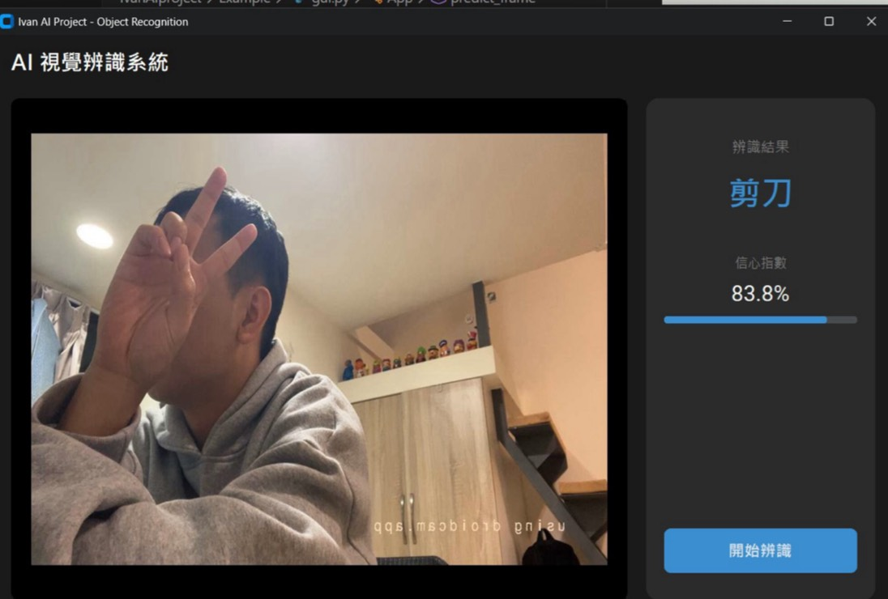

# Ivan AI Project - Object Recognition System

本專案實作了一個基於 Teachable Machine 的 AI 物件辨識系統，結合 Python CustomTkinter 介面與無線網路攝影機 (DroidCam) 應用。

## 專案開發流程 (Project Workflow)

### 1. Teachable Machine 模型訓練
使用 Google Teachable Machine 平台收集影像數據並訓練分類模型。
- 匯出模型格式：TensorFlow (Keras) `.h5`
- 產出檔案：`keras_model.h5`, `labels.txt`

### 2. 串接 DroidCam Webcam
為了靈活進行辨識，我們使用手機作為 IP Camera。
- App：DroidCam
- 連線方式：Wi-Fi (區域網路)
- 設定：在 `camera_config.txt` 中填入 DroidCam 提供的 IP 串流位址 (例如 `http://192.168.X.X:4747/video`)。


*(上圖：手機端 DroidCam 連線畫面)*

### 3. 初步 GUI 介面生成
使用 Python `customtkinter` 建立基礎視窗，驗證模型載入與影像串流功能。此階段專注於功能實現：
- 左側顯示攝影機畫面
- 右側顯示辨識出的類別文字


*(上圖：開發初期的功能驗證介面)*

### 4. 介面優化與結果呈現
針對 UI/UX 進行深度優化，打造具現代科技感的視覺風格。
- **視覺風格**：採用 Dark Mode (深色模式) 與科技藍配色。
- **效能優化**：調整影像更新率與解析度，確保執行流暢。
- **結果視覺化**：新增「信心指數 (Confidence)」進度條，讓辨識結果更直觀。


*(上圖：優化後的最終成品介面)*

## 如何執行 (How to Run)

1. 確保已安裝 Python 依賴套件：
   ```bash
   pip install -r requirements.txt
   ```
2. 設定攝影機來源：
   - 修改 `Example/camera_config.txt`，填入您的 IP Camera 網址。
   - 若無檔案或留空，將預設使用電腦 Webcam (0)。
3. 啟動程式：
   ```bash
   python gui.py
   ```

## 檔案結構
- `gui.py`: 主程式 (GUI 與 辨識邏輯)
- `camera_config.txt`: 攝影機設定檔 (已從程式碼中抽離以保護隱私)
- `keras_model.h5`: 訓練好的 AI 模型
- `labels.txt`: 分類標籤
